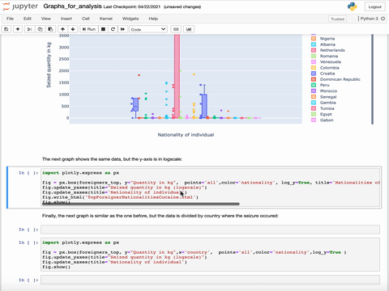

## Project 1: Understanding the actors in the cocaine supply chain in Europe
<center>
  
</center>


Analysed the nationalities of the individuals involved in the illegal trafficking of cocaine in Europe, according to the scale of trafficking. Analysis and visualizations presented in the [World Drug Report 2021 (booklet 4)](https://www.unodc.org/unodc/en/data-and-analysis/wdr-2021_booklet-4.html). 

## Project 2: Building a dashboard for exploratory analysis of cocaine flows in South America.


## Project 3: Visualizing spatial and temporal trends of cocaine trafficking in Europe
Extract unestructured data provided by an official source and structure to provide new insights of illicit flows in Europe. Analysis and visualizations presented in the UNODC report [Cocaine Insights 1](https://www.unodc.org/documents/data-and-analysis/cocaine/Cocaine_Insights_2021.pdf)


## Welcome to GitHub Pages

You can use the [editor on GitHub](https://github.com/alanarroyo/Portfolio/edit/gh-pages/index.md) to maintain and preview the content for your website in Markdown files.

Whenever you commit to this repository, GitHub Pages will run [Jekyll](https://jekyllrb.com/) to rebuild the pages in your site, from the content in your Markdown files.

### Markdown

Markdown is a lightweight and easy-to-use syntax for styling your writing. It includes conventions for

```markdown
Syntax highlighted code block

# Header 1
## Header 2
### Header 3

- Bulleted
- List

1. Numbered
2. List

**Bold** and _Italic_ and `Code` text

[Link](url) and 
```

For more details see [GitHub Flavored Markdown](https://guides.github.com/features/mastering-markdown/).

### Jekyll Themes

Your Pages site will use the layout and styles from the Jekyll theme you have selected in your [repository settings](https://github.com/alanarroyo/Portfolio/settings/pages). The name of this theme is saved in the Jekyll `_config.yml` configuration file.

### Support or Contact

Having trouble with Pages? Check out our [documentation](https://docs.github.com/categories/github-pages-basics/) or [contact support](https://support.github.com/contact) and we’ll help you sort it out.
